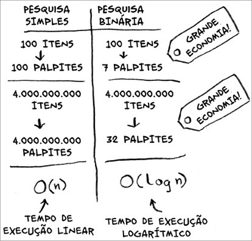

A Pesquisa Binária é executada com *tempo logarítmico*.

## Notação Big O

A notação Big O é uma notação especial que diz o quão rápido é um algoritmo. Você frequentemente utilizará o algoritmo que outra pessoa fez - e quando faz isso, é bom entender o quão rápido ou lento o algoritmo é.

