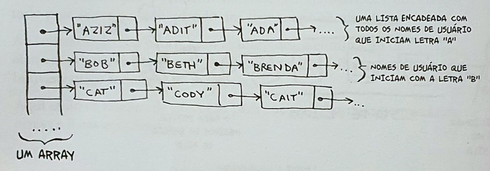

## EXERCÍCIOS

##### 2.1 Suponha que você esteja criando um aplicativo para acompanhar as suas finanças.

1. COMPRAS
2. CINEMA
3. MENSALIDADE DO SFBC

Todos os dias você anotará tudo o que gastou e onde gastou. No final do mês, você deverá revisar os seus gastos e resumir o quanto gastou. Logo, você terá um monte de inserções e poucas leituras. Você deverá usar um array ou uma lista para implementar este aplicativo?

  
<b>RESPOSTA 2.1</b>
 
    Como haverá mais inserções que leituras, e já que inserção na lista tem tempo de execução constante O(1), deveremos usar a lista. 
    Vale lembrar que a leitura vai ser feita uma vez no mês, e ela pode ser feita em sequência, o que não seria um problema para uma lista encadeada.

-------

##### 2.2 Suponha que você esteja criando um aplicativo para anotar os pedidos dos clientes em um restaurante. Seu aplicativo precisa de uma lista de pedidos. Os garçons adicionam os pedidos a essa lista e os chefes retiram os pedidos da lista, Funciona como uma fila. Os garçons colocam os pedidos no final da fila e os chefes retiram os pedidos do começo dela para cozinhá-los. Você usaria um array ou uma lista encadeada para implementar essa lista?

*(Dica: listas encadeadas são boas para inserções/eliminações e arrays são bons para acesso aleatório. O que fazer neste caso?)*

  
<b>RESPOSTA 2.2</b>
 
    A lista encadeada tem um ótimo desempenho na inserção e eliminação. Como os garçons sempre irão inserir no final, e os chefs irão sempre eliminar o primeiro item, a lista encadeada é a mais indicada neste caso.

-------

##### 2.3 Vamos analisar um experimento. Imagine que o Facebook guarda uma lista de usuários. Quando alguém tenta acessar o Facebook, uma busca é feita pelo nome de usuário. Se o nome da pessoa está na lista, ela pode continuar o acesso. As pessoas acessam o Facebook com muita frequência, então existem muitas buscas nessa lista. Presuma que o Facebook usa a pesquisa binária para procurar um nome na lista. A pesquisa binária requer acesso aleatório - você precisa ser capaz de acessar o meio da lista de nomes instantaneamente. Sabendo disso, você implementaria essa lista como um array ou uma lista encadeada?

  
<b>RESPOSTA 2.3</b>
 
    O Array tem um bom desempenho no acesso aleatório a itens, portanto, principalmente pensando em pesquisa binária, um Array ordenado se torna o mais adequado para o caso.

-------
##### 2.4 As pessoas se inscrevem no Facebook com muita frequência também. Suponha que você decida usar um array para armazenar a lista de usuários. Quais as desvantagens de um array em relação as inserções? Em particular, imagine que você está usando a pesquisa binária para buscar os logins, O que acontece quando você adiciona novos usuários em um array?

  
<b>RESPOSTA 2.4</b>
 
    Inserções em arrays são lentas. Além disso, se você estiver utilizando a pesquisa binária para procurar os nomes de usuário, o array precisará estar ordenado. Suponha que alguém chamado <b>Adit B</b> se registre no Facebook. O nome dele será inserido no final do array. Assim, você precisa ordenar o array cada vez que um nome for inserido!

-------
##### 2.5 Na verdade, o Facebook não usa nem arrays nem listas encadeadas para armazenar informações. Vamos considerar uma estrutura de dados híbrida: um array de listas encadeadas, Você tem um array com 26 slots. Cada slot aponta para uma lista encadeada. Por exemplo, o primeiro slot do array aponta para uma lista encadeada que contém os usuários que começam com a letra A. O segundo slot aponta para a lista encadeada que contém os usuários que começam com a letra B, e assim por diante.

Suponha que o <b>Adit B</b> se inscreva no Facebook e você queira adicioná-lo à lista. Você vai ao slot 1 do array, a seguir para a lista encadeada do slot 1, e adiciona <b>Adit B</b> no final. Agora, suponha que você queira procurar o <b>Zakhir H</b>. Você vai ao slot 26, que aponta para a lista encadeada de todos os nomes começados em Z. Então, procura pela lista até encontrar o <b>Zakhir H</b>.

Compare esta estrutura híbrida com arrays e listas encadeadas. É mais lento ou mais rápido fazer inserções e eliminações nesse caso? Você não precisa responder dando o tempo de execução <b>Big(0)</b>. apenas diga se a nova estrutura de dados é mais rápida ou mais lenta do que os arrays e as listas encadeadas.

  
<b>RESPOSTA 2.5</b>
 
    Para buscas - mais lenta do que arrays, mais rápida do que listas encadeadas. Para inserções mais rápida do que arrays, mesmo tempo que as listas encadeadas. Portanto é mais lenta para buscas que os arrays, porém mais rápida ou igual às listas encadeadas para tudo. Falaremos sobre outra estrutura de dados híbridos chamada tabela hash depois. Isto deve dar uma ideia sobre como é possível construir estruturas de dados mais complexas a partir das estruturas mais simples. 
    Então, o que o Facebook realmente utiliza? Provavelmente uma dúzia de diferentes bancos de dados com diferentes estruturas por trás deles, como tabelas hash, árvores B e outras. Os arrays e as listas encadeadas são os blocos fundamentais para estruturas de dados mais complexas.

-------